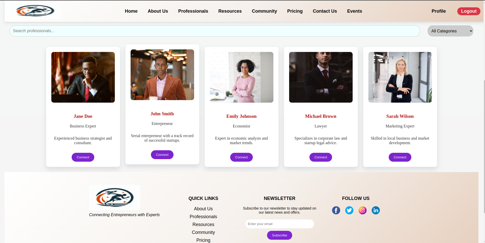

# Start-Up Support
## Empowering African Entrepreneurs

Welcome to StartupSupport, a platform dedicated to empowering African entrepreneurs by bridging the gap between innovative business ideas and the expertise required to bring them to life. Our mission is to provide essential guidance, resources, and networking opportunities to support entrepreneurs at every stage of their journey.

## Project Overview
StartupSupport aims to connect aspiring entrepreneurs with seasoned experts, offering a comprehensive suite of tools and resources to foster business growth and development. Our platform features an Integrated Mentorship and Advisory Program, as well as a Comprehensive Networking and Resource Hub, tailored to meet the unique needs of African startups.

## Features
### For Entrepreneurs:
#### Startup Resources: 
Access guides, templates, and industry-specific startup kits to kickstart your business.
Engage in online courses, video tutorials, and webinars from industry experts.

#### Mentorship Programs: 
Connect with experienced mentors for personalized guidance.

#### Networking Events: 
Participate in events, workshops, and virtual networking sessions.

### For Experts:
#### Profile Management:
Create and update your professional profile to showcase your expertise.

#### Resource Sharing: 
Upload and share educational content, articles, and templates.

#### Event Hosting: 
Host events and Workshops.

#### Networking and Collaboration: 
Connect with other experts and participate in collaborative projects.

# Our Mission
At Milka StartupSupport, our mission is to empower African entrepreneurs by providing them with the essential expertise, resources, and network needed to launch and grow successful businesses. We strive to create a supportive ecosystem where innovative ideas can flourish, bridging the gap between aspiring business owners and seasoned industry experts. Through mentorship, education, and access to funding opportunities, we aim to drive economic growth and foster a thriving entrepreneurial community across Africa.

# Getting Started

To get started Follow the steps:
1. clone the repository
```
git clone git@github.com:Ararsa-Derese/StartupSupport.git
```
## Setting up the Backend
2. Navigate to backend repository

```
cd backend/
```

3. Create a virtual env and activate
```
python3 -m venv env
source env/bin/activate
```
4. install requirments
```
pip install -r requirements.txt
```
5. Run the server 
```
python manage.py runserver
```
## Setting up the Front-end

6. Open another terminal and navigate to web folder

```
cd frontend/web
```
7. Install necessary dependencies

``` 
npm install
```
8. Build
```
npm run build
```
9. Navigate to Parent folder (frontend)

```
cd ..
```
10. Install necessary dependencies for the Express

```
npm install
```
11. Run the Server
```
npm start
```


